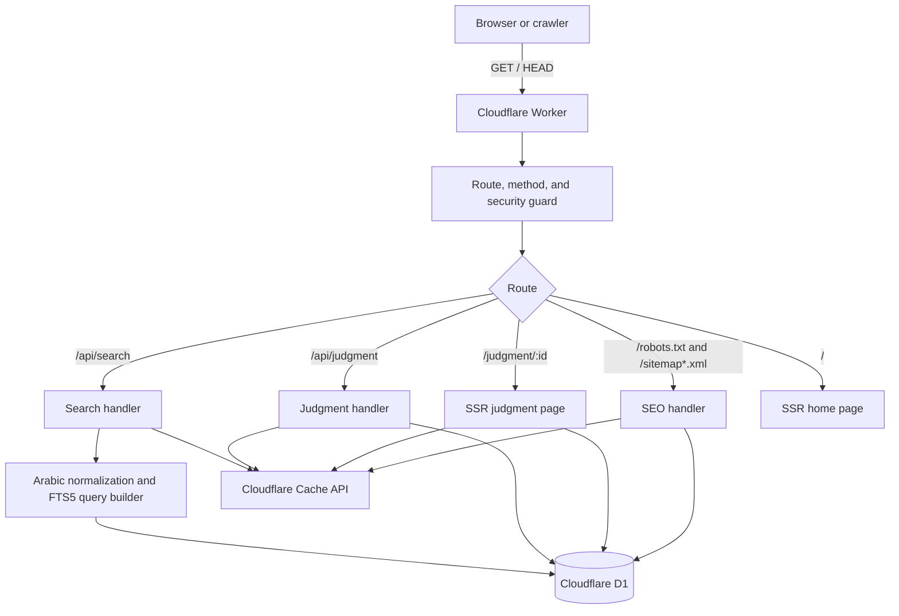

<div align="center">

# ⚖️ أحكام | Ahkam Engine

### High-performance Arabic legal search on the edge

[](#architecture)
[-0051C3?style=for-the-badge&logo=sqlite&logoColor=white)](#data-model)
[-F7DF1E?style=for-the-badge&logo=javascript&logoColor=black)](#repository-layout)
[](#license)

<p align="center">
  <b>An edge-native research platform for Egyptian court judgments and legal principles.</b><br>
  Arabic-aware search, server-rendered judgment pages, Cloudflare D1, and safe edge caching.
</p>

[Overview](#overview) ·
[Capabilities](#capabilities) ·
[Architecture](#architecture) ·
[Data model](#data-model) ·
[Quick start](#quick-start) ·
[API](#api) ·
[Deployment](#deployment)

</div>

## Overview

**أحكام (Ahkam)** is a Cloudflare Worker for searching Egyptian judgments and their legal principles (*المبادئ القانونية*). It accounts for Arabic orthographic variants and common clitic prefixes—so a query such as `إعلان` can match words such as `وبالإعلان`—then returns safe, highlighted excerpts from a Cloudflare D1 database.

## Capabilities

- **Arabic-aware search:** normalizes diacritics, tatweel, Alef/Hamza forms, and Alef Maksura/Ya in a rebuildable FTS projection, while preserving original text for display. It deliberately does not collapse Ta Marbuta and Ha.
- **Judgment-level relevance:** FTS retrieves candidates, then D1 groups them by `Master_ID`, so an AND query can match terms in different sections of the same judgment. The default scope includes `Master_Text` plus all text sections; each result has at most three SQL-ranked excerpts.
- **Search controls:** supports normal/AND, OR, exact phrase, exclusion, full/principles/reasons scopes, relevance/newest/oldest ordering, and validated court, case, date, chamber, type, and category filters.
- **Judgment lookup:** retrieves a judgment by its `Master_ID`, or by case number and judicial year; ambiguous case lookups return a compact choice list.
- **Edge delivery:** renders the home page and individual judgment pages in the Worker, with `GET`, `HEAD`, and `OPTIONS` handling.
- **Safe operations:** uses canonical cache keys, prepared statements, security headers, request IDs, CORS allowlisting, Workers rate limiting, and privacy-aware zero-result analytics.
- **Search-engine support:** provides `robots.txt`, a sitemap index when needed, and paginated sitemap documents.

## Supported court filters

The API accepts one court ID or a comma-separated list of up to five IDs. Text search exposes these grouped filters:

| Filter | Court |
| --- | --- |
| `1,29` | محكمة النقض — الأحكام المدنية وسوابق النقض المدني |
| `2,30` | محكمة النقض — الأحكام الجنائية وسوابق النقض الجنائي |
| `4,25` | المحكمة الدستورية العليا وسوابقها |
| `3,37` | المحكمة الإدارية العليا وسوابقها |
| `31,36,47` | القضاء الإداري وسوابقه وأحكام المحكمة الإدارية |
| `3,31,36,37,47` | مجلس الدولة — جميع المحاكم والسوابق |
| `21` | المحكمة العليا |
| `24` | محكمة جنائي عابدين |
| `35` | أحكام الدعم والإغراق |

The shortcuts combine each court with its matching precedents where available. The default text-search scope is the full judgment; users can restrict it to principles or reasons/verdict.
Case-number search exposes the individual court datasets, including precedent collections.

## Architecture



## Data model

The Worker reads an existing D1 database. The optimization migrations in `migrations/` **do not create or seed the base schema**; they require these tables and FTS index to already exist:

| Object | Used for |
| --- | --- |
| `Judgments_Master` | Judgment metadata and full text |
| `Judgments_Text` | Ordered paragraphs/excerpts |
| `Judgments_Principles` | Extracted legal principles |
| `Judgments_Principles_Links` | Links between principles and paragraphs |
| `Courts` | Court names |
| `FTS_Judgments` | Legacy paragraph FTS5 index retained for compatibility |
| `FTS_Judgments_Normalized` | Rebuildable normalized retrieval index for full-judgment search |
| `Judgment_Metadata` | Additive searchable metadata: chamber/type/category/source/provenance |
| `Judgment_Relations` | Additive editorial and future semantic relations |
| `Search_Analytics` | Privacy-aware query-quality telemetry |

The migrations add composite lookup indexes and remove redundant duplicates. Apply them only after importing or provisioning the base database.

## Repository layout

```text
.
├── migrations/
│   ├── 0001_indexes.sql                 # Initial lookup indexes
│   ├── 0002_search_indexes.sql          # Additional composite indexes
│   └── 0003_drop_duplicate_indexes.sql  # Removes superseded indexes
├── src/
│   ├── index.js                          # Worker entry point and route dispatch
│   ├── lib/
│   │   ├── arabic.js                     # Normalization, variants, FTS5, highlighting
│   │   ├── cache.js                      # Cache-key and Cache API helpers
│   │   ├── db.js                         # D1 queries
│   │   └── security.js                   # Validation, CORS, security headers
│   ├── routes/
│   │   ├── api.js                        # JSON API handlers
│   │   └── seo.js                        # robots.txt and sitemap handlers
│   └── ui/
│       └── templates.js                  # Server-rendered HTML and client behavior
├── wrangler.toml                         # Worker and D1 binding configuration
└── README.md
```

## Quick start

### Prerequisites

- A current Node.js release supported by Wrangler.
- A Cloudflare account with access to the configured D1 database, or a local database initialized with the required base schema and data.

### Run locally

```bash
npm test
npx wrangler dev
```

Wrangler reads the `DB` binding from `wrangler.toml`. Open the local address printed by Wrangler (normally `http://localhost:8787`).

### Apply index migrations

After the base schema has been imported into the target database, apply the repository migrations:

```bash
# Local D1 database
npx wrangler d1 migrations apply DB --local

# Bound remote D1 database
npx wrangler d1 migrations apply DB --remote
```

> The repository does not include a base-schema or data-import migration. Running these index-only migrations against an empty database will fail because the referenced tables do not yet exist.

## API

All API responses are JSON. Valid API responses include the security headers configured in `src/lib/security.js`. `OPTIONS` requests receive CORS headers only for approved origins.

### Search judgments

```http
GET /api/search?q={query}&court={courtIds}&page={page}&page_size={pageSize}&sort=relevance&mode=normal&scope=full
```

| Parameter | Required | Default | Rules |
| --- | --- | --- | --- |
| `q` | Yes | — | 2–160 characters; up to 10 parsed search units |
| `court` | No | all courts | One to five positive IDs, comma-separated |
| `page` | No | `1` | Integer from `1` to `10,000`; kept for stable URLs |
| `page_size` | No | `20` | Integer from `5` to `50` |
| `sort` | No | `relevance` | `relevance`, `newest`, or `oldest` |
| `mode` | No | `normal` | `normal`, `and`, `or`, or `exact` |
| `scope` | No | `full` | `full`, `principles`, or `reasons` |
| `cursor` | No | — | Opaque cursor returned as `next_cursor` for efficient forward traversal |
| `case_no`, `case_year`, `date_from`, `date_to`, `chamber`, `type`, `category` | No | — | Validated advanced filters |

`q` accepts 2–280 characters and up to 12 parsed search units.

Example:

```http
GET /api/search?q=إعلان&court=1,29&page=1&page_size=20&sort=relevance&scope=full
```

Successful responses have this shape (diagnostic D1 metrics are intentionally omitted from the public response):

```json
{
  "found": true,
  "page": 1,
  "page_size": 20,
  "total_matches": 1,
  "total_judgments": 1,
  "has_more": false,
  "results": [
    {
      "Master_ID": 1042,
      "Case_No": 125,
      "Case_Year": 85,
      "Case_Date": "2018-05-12",
      "Office_Year": null,
      "Court_Name": "محكمة النقض",
      "best_rank": -8.2,
      "match_count": 1,
      "matches": [
        {
          "Fakra_No": 1,
          "fakraLabel": "مبدأ رقم 1",
          "snippet": "… <mark>الإعلان</mark> بصحيفة الدعوى …"
        }
      ]
    }
  ]
}
```

### Retrieve a judgment

Look up a judgment by its ID:

```http
GET /api/judgment?id={masterId}
```

Or locate it by case number and judicial year. `court` is optional here, but when supplied it must be a single ID:

```http
GET /api/judgment?no={caseNumber}&yr={caseYear}&court={courtId}
```

A unique match returns `found`, `master`, `texts`, and `principles`. If more than one judgment matches a case-number lookup, the response instead includes `multiple: true` and compact `judgments` records; request one of their `Master_ID` values to fetch the complete record.

```json
{
  "found": true,
  "master": {
    "Master_ID": 1042,
    "Case_No": 125,
    "Case_Year": 85,
    "Court_Name": "محكمة النقض"
  },
  "texts": [],
  "principles": []
}
```

### Other public routes

| Route | Purpose |
| --- | --- |
| `/` | Search interface with interactive court statistics and debounced search |
| `/courts/:slug` | Dedicated indexable court landing pages (`cassation-civil`, `cassation-criminal`, `constitutional`, `administrative-high`, `administrative`) |
| `/judgment/:id` | Server-rendered judgment page with citation copying, bookmarking, and print layout |
| `/api/court-judgments` | Cached court judgment listing with Keyset pagination |
| `/robots.txt` | Crawler directives |
| `/sitemap.xml` | Sitemap or sitemap index with accurate `<lastmod>` and court landing pages |
| `/sitemap-:page.xml` | A 5,000-record sitemap page |
| `/favicon.ico`, `/favicon.svg` | Worker-served application icon |

## Research Workspace & Features

- **Debounced Search-as-you-type:** Automatically queries after 350ms of typing inactivity, preventing server load and updating the URL via silent history replace.
- **Interactive Court Filters:** Dynamic count cards allowing instant client-side and server-side filtering across the 5 primary judicial jurisdictions.
- **Bookmarks & Saved Judgments:** Lawyers and legal researchers can save rulings to their workspace, review them in a dedicated tab, copy full citation lists, and export them.
- **Citation Generator:** Instant one-click copying of official Egyptian legal citations formatted according to standard judicial practice.
- **Multi-tier Rate Limiting:** Cloudflare Workers Rate Limiting binding with in-memory sliding-window fallback protecting `/api/search`, `/api/court-judgments`, and `/api/judgment`.

## Security and caching

- Only `GET`, `HEAD`, and `OPTIONS` are accepted; other methods receive `405 Method Not Allowed`.
- Search, case, and ID parameters are validated before querying D1. Arabic-Indic and Persian digits are normalized for numeric parameters.
- CORS is restricted to the origins listed in `ALLOWED_ORIGINS`; cache keys include an approved origin only when necessary.
- API cache keys retain only documented query parameters. Query strings on judgment pages and sitemap routes are discarded, preventing cache-key fragmentation.
- The Worker sends CSP, HSTS, frame, referrer, permissions, and content-type protection headers.
- Search results are cached for 30 minutes; judgment JSON for 2 hours; HTML judgment pages, sitemaps, and `robots.txt` for 24 hours. Cache writes use `ctx.waitUntil()` when available.

## Deployment

1. Create or select a Cloudflare D1 database containing the required base schema and data.
2. Set its `database_name` and `database_id` under the `DB` binding in `wrangler.toml`.
3. Apply the index migrations:

   ```bash
   npx wrangler d1 migrations apply DB --remote
   ```

4. Deploy the Worker:

   ```bash
   npx wrangler deploy
   ```

If you use a custom domain, configure it through the `routes` entry in `wrangler.toml` and Cloudflare DNS.

## License

This project is licensed under the [MIT License](LICENSE).
